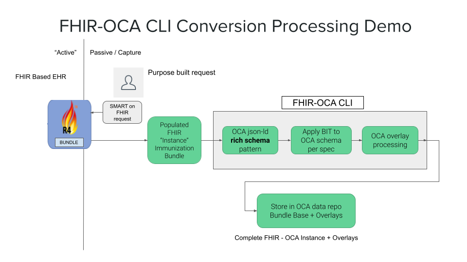

# oca-fhir-cli
Extensible CLI tool to convert FHIR R4 bundle in to OCA Schema base and core overlays (Character, Entry, Format, Information and Label overlays). 

**Caveats:** The following modules are provided strictly for demonstration purposes only, and not intended for production use. These modules have not been reviewed or approved by governing entities relevant to the standards below.

This release contains the following example modules:
1. Canadian Vaccine Catalog (CVC) Immunization Bundle: The tool will convert a [CVC Immunization](https://cvc.canimmunize.ca/en/home) Bundle of type *collection* with the following *resourceType* elements: *Patient, Practitioner, Immunization, ImmunizationRecommendation*. The generated OCA artifacts (schema base and overlays) may then be used in your application to create appropriate forms (for data capture), sub-set schemas can be used to create VC's (verifiable credentials) for decentralized data sharing, depending on the use case.
2. CDC Covid-19 Vaccination Reporting example (work in progress): Input file example is provided in csv format, [per CDC Covid-19 reporting specification](https://www.cdc.gov/vaccines/covid-19/reporting/requirements/index.html). The tool will covert this input file in to a FHIR R4 bundle internally. Currently, this input csv is mapped to a FHIR R4 Bundle with *Patient, Immunization*, resources. This mapping is customizable via the use of a *ConceptMap* (provided), but the recommended approach is to follow the community best practice of creating a FHIR Implementation Guide based.

## Usage

### Pre-requisites
Nodejs v14.15.3 or later (very likely that this project will rely on nodejs v14 or later due to dependencies)

`$node oca-fhir-cli.js --profile cvc-immunization-bundle --input examples/patient-bundle-instance-example.json`
`$node oca-fhir-cli.js --profile cdc-cvrs-v2.5 --csv .\examples\cdc-cvrs-v2.5\sample-data.csv`

### Release notes
1. CDC CVRS profile option is WIP. But you can browse the *examples/cdc-cvrs-2.5* directory to review input csv, FHIR R4 json bundle, ConceptMap and other conformance artifacts.
2. Generated label overlay jsonld should be treated as a representative instance document only: we expect this to be edited for appropriate use in web forms based on jurisdiction (e.g. language, FHIR profiles in use).
3. Blinding Identity Taxonomy attributes identified in schema base is not intended to be prescriptive. FHIR resource properties that map to Who, What, When, Where, Why are currently flagged.
4. Full validation of FHIR Profiles, Extensions and use of appropriate ValueSets prior to use of this cli tool is assumed. We recommend using FHIR Validator tool against the input FHIR R4 bundle, prior to processing using this cli tool to create corresponding OCA artifacts.

### FAQ
1. Is there a list of FHIR R4 resources that are supported within input Bundles?

   This release supports the following FHIR R4 resource types: *Bundle, Consent, Contract, ImagingStudy, Immunization, Patient, Practitioner*.
   Other resources to be supported: 
- ImmunizationEvaluation
- RelatedPerson
- PractitionerRole
- Group
- Organization
- Location

2. Is this cli tool extensible?
 Yes, the driver script (*oca-fhir-cli.js*) provides a mechanism to load js modules that implement extension functionality for specific applications such as Immunization Passport etc. Such extensions can be made available in the *lib* directory. The extension module should implement *verifyBundle* and *generateOCAArtifacts* functions to suit application needs.
